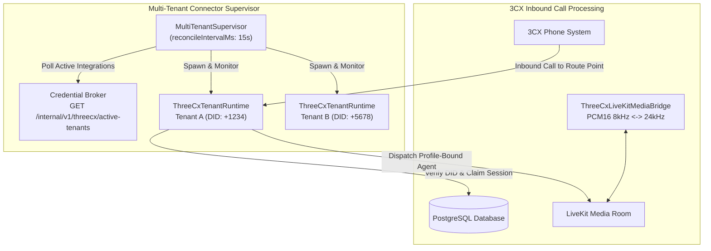
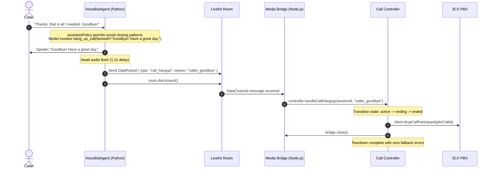

# Dynamic Multi-Tenant 3CX PBX & Conversational Call Hangup

This document details the architectural enhancements, file changes, and operational behavior implemented to make the 3CX PBX integration dynamic for arbitrary customer accounts, and to enable conversational call completion (hang-up) via assistant intent and silence watchdog.

---

## 1. Executive Summary & Root Cause

### Previous Limitations
1. **Single-Account Binding (`anesu@intern-mail.metabox.technology`):**
   - In development, the local database was seeded with only one account: `anesu@intern-mail.metabox.technology`.
   - `sessionContext.ts` derived `company_id = stableCompanyId(userId)` from the active Neon Auth user. Because only Anesu existed in the dev environment, all company-scoped queries, PBX routes, and token creations resolved to Anesu's company ID.
   - Development security guards (`STRICT_ACCOUNT_ACCESS.md`) explicitly gated token creation to Anesu's email.
2. **Static Single-Tenant Connector Runtime:**
   - The 3CX connector previously assumed a single static PBX connection runtime rather than dynamically supervising active tenant configurations registered across multiple accounts.
3. **No Conversational Hangup:**
   - When callers concluded their inquiry (saying "thank you", "goodbye", "that's all"), the voice assistant would acknowledge the phrase but keep the telephone line open indefinitely.
   - If the caller hung up or if the agent disconnected abruptly, the bridge often interpreted it as an unhandled transport failure, triggering unnecessary fallback transfers to receptionist extensions.

### What Was Improved
- **Dynamic Multi-Tenant Supervision:** Added a multi-tenant connector supervisor that periodically queries active PBX configurations across all companies, spins up isolated PBX runtimes, updates them on credential or DID changes, and drains removed tenants gracefully.
- **Conversational Hangup Tool (`hang_up_call` / `end_call`):** Equipped the LLM with a dedicated function tool to end calls politely after bidding farewell.
- **Audio-Safe Sequencing:** The agent speaks the farewell message, flushes audio buffers, sends an explicit `call_hangup` data packet over the LiveKit DataChannel, and cleanly disconnects.
- **Silence Watchdog:** If a caller remains silent for 15 seconds without speaking (configurable via `SILENCE_WATCHDOG_TIMEOUT_SECONDS`), the assistant automatically gives a parting message and disconnects the call.
- **Clean PBX Teardown:** The call controller differentiates between planned hangups (`handleCallHangup`) and network/media failures (`handleMediaFailure`), ensuring the PBX drops the call participant cleanly without triggering error fallbacks.

---

## 2. Architecture & Call Flow

### Inbound Call to Dynamic Tenant Runtime


### Conversational Hangup Sequence


---

## 3. Comprehensive File-by-File Change Log

### A. Core Agent & Policy (`agent/`)

#### 1. [`agent/agent.py`](file:///c:/Users/Elihu%20Joseph%20MetaBox/Documents/v5/AI-Voice-Assistants/agent/agent.py)
* **What changed:**
  - Added `@llm.function_tool` `hang_up_call` and alias `end_call` to `VoiceBotAgent`.
  - Added `permitted_tools = set(self._policy.calendar_tool_names) | {"hang_up_call", "end_call"}` to allow hangup tools while preserving calendar policy security.
  - Implemented graceful audio sequencing: speaks the farewell response, flushes the audio playback buffer with `asyncio.sleep(1.2)`, publishes `{"type": "call_hangup", "reason": reason}` over the LiveKit data channel, and closes the room session.
  - Added silence watchdog tracking: initializes `last_user_activity = [time.monotonic()]`, updates it on `on_user_input`, and runs `_silence_watchdog` terminating the call after 15 seconds (`SILENCE_WATCHDOG_DEFAULT_TIMEOUT_SECONDS = 15.0`) of continuous idle silence.
* **Why it was needed:**
  - Allows the LLM to understand when an interaction is over and cleanly drop the telephone line instead of holding the customer on an open channel.

#### 2. [`agent/tests/test_call_hangup.py`](file:///c:/Users/Elihu%20Joseph%20MetaBox/Documents/v5/AI-Voice-Assistants/agent/tests/test_call_hangup.py) *(New)*
* **What changed:**
  - Added 4 automated unit tests for call hangup and silence watchdogs using Python standard library `unittest`:
    - `test_hang_up_call_invokes_disconnect_and_sends_packet`
    - `test_end_call_alias`
    - `test_silence_watchdog_triggers_hangup`
    - `test_silence_watchdog_resets_on_user_input`
* **Why it was needed:**
  - Ensures call hangup tool dispatch and watchdog timeouts behave predictably and pass in CI/local testing.

---

### B. Frontend Policy & UI (`frontend/`)

#### 3. [`frontend/src/lib/assistantPolicy.json`](file:///c:/Users/Elihu%20Joseph%20MetaBox/Documents/v5/AI-Voice-Assistants/frontend/src/lib/assistantPolicy.json)
* **What changed:**
  - Extended `patterns.social` regex list to include closing keywords:
    - `"\\b(bye|goodbye|have a nice day|have a good (day|one)|that is all|that's all|nothing else|no thanks|all good|talk to you later|au revoir|merci c'est tout|c'est tout)\\b"`
* **Why it was needed:**
  - Prevents the assistant policy engine from flagging standard parting remarks as off-topic violations, enabling the LLM to reply with a polite closing statement and trigger the hangup tool.

---

### C. Database & Credential Broker (`db/` & `backend/`)

#### 4. [`db/threecx.py`](file:///c:/Users/Elihu%20Joseph%20MetaBox/Documents/v5/AI-Voice-Assistants/db/threecx.py)
* **What changed:**
  - Added `list_active_threecx_integrations()` query.
  - Retrieves all active 3CX configurations (`WHERE state = 'active'`) returning company ID, connection name, PBX hostname, app ID, Route Point DN, DIDs, transfer destinations, and failure actions.
* **Why it was needed:**
  - Enables multi-tenant connector supervisor to discover all registered companies that need active PBX listeners.

#### 5. [`backend/credential_broker/main.py`](file:///c:/Users/Elihu%20Joseph%20MetaBox/Documents/v5/AI-Voice-Assistants/backend/credential_broker/main.py)
* **What changed:**
  - Added `GET /internal/v1/threecx/active-tenants` protected by `require_broker_secret`.
  - Maps database rows to sanitized tenant configuration descriptors (`companyId`, `connectionName`, `pbxHostname`, `appId`, `routePointDn`, `dids`, etc.) without exposing client secrets.
* **Why it was needed:**
  - Provides a secure endpoint for the connector daemon to poll active customer integrations.

---

### D. Connector Multi-Tenant & Call Lifecycle (`connector/`)

#### 6. [`connector/multi-tenant-supervisor.mjs`](file:///c:/Users/Elihu%20Joseph%20MetaBox/Documents/v5/AI-Voice-Assistants/connector/multi-tenant-supervisor.mjs) *(New)*
* **What changed:**
  - Implemented `MultiTenantSupervisor` class:
    - Manages a registry of active tenant runtimes (`Map<companyId, RuntimeEntry>`).
    - Periodic reconciliation loop (`reconcileIntervalMs: 15000`).
    - Compares current active tenants against running instances.
    - Spawns new runtimes when accounts configure 3CX.
    - Gracefully stops and drains runtimes when accounts are disabled or deleted.
    - Hot-reloads runtime if configuration or DIDs change (fingerprint tracking).
* **Why it was needed:**
  - Removes the single-tenant limitation by automatically supervising dedicated PBX runtimes per registered customer company.

#### 7. [`connector/run-supervisor.mjs`](file:///c:/Users/Elihu%20Joseph%20MetaBox/Documents/v5/AI-Voice-Assistants/connector/run-supervisor.mjs) *(New)*
* **What changed:**
  - Standalone service entrypoint for the multi-tenant supervisor.
  - Connects to Credential Broker via `CREDENTIAL_BROKER_URL` and `CREDENTIAL_BROKER_SHARED_SECRET`.
  - Instantiates broker-bound runtimes that request leases securely.
  - Handles process signals (`SIGINT`, `SIGTERM`) to trigger clean drain before exit.
* **Why it was needed:**
  - Provides an out-of-the-box CLI command (`node run-supervisor.mjs` or `npm start`) to run the multi-tenant connector in Docker, Railway, or local development.

#### 8. [`connector/package.json`](file:///c:/Users/Elihu%20Joseph%20MetaBox/Documents/v5/AI-Voice-Assistants/connector/package.json)
* **What changed:**
  - Added `"start": "node run-supervisor.mjs"` to `scripts`.
* **Why it was needed:**
  - Standardizes the supervisor startup script.

#### 9. [`connector/call-controller.mjs`](file:///c:/Users/Elihu%20Joseph%20MetaBox/Documents/v5/AI-Voice-Assistants/connector/call-controller.mjs)
* **What changed:**
  - Implemented `handleCallHangup({ sessionId, reason })`:
    - Checks whether the session is active.
    - Transitions session state from `active` -> `ending` -> `ended` in the database.
    - Drops PBX participant via `client.dropCallParticipant`.
    - Closes media bridge and stops the agent dispatch cleanly.
    - Suppresses error fallbacks (e.g. transfer to receptionist) since this is an intended completion.
* **Why it was needed:**
  - Prevents planned call completions from being treated as WebRTC transport crashes or PBX line drops.

#### 10. [`connector/threecx-livekit-media-bridge.mjs`](file:///c:/Users/Elihu%20Joseph%20MetaBox/Documents/v5/AI-Voice-Assistants/connector/threecx-livekit-media-bridge.mjs) & [`connector/verified-threecx-livekit-media.mjs`](file:///c:/Users/Elihu%20Joseph%20MetaBox/Documents/v5/AI-Voice-Assistants/connector/verified-threecx-livekit-media.mjs)
* **What changed:**
  - Added `onHangup` callback parameter.
  - Subscribed to LiveKit Room DataChannel events:
    - Listens for packets where `data.type === "call_hangup"`.
    - Sets `hangingUp = true` on the bridge instance.
    - Dispatches `onHangup({ reason: data.reason })`.
  - Updated participant disconnect handler to check `hangingUp`: if true, ignores the disconnect instead of calling `onMediaFailure`.
* **Why it was needed:**
  - Connects the agent's Python hangup signal to the Node.js call controller and prevents false media failure alerts.

#### 11. [`connector/tests/call-controller.test.mjs`](file:///c:/Users/Elihu%20Joseph%20MetaBox/Documents/v5/AI-Voice-Assistants/connector/tests/call-controller.test.mjs)
* **What changed:**
  - Added unit test: `handles call hangup cleanly without triggering error fallback policy`.
  - Verifies that `handleCallHangup` transitions session state to `ended`, drops the PBX call, and avoids invoking `performSafeFallback`.
* **Why it was needed:**
  - Guarantees regression protection for call hangup flows.

#### 12. [`connector/tests/multi-tenant-supervisor.test.mjs`](file:///c:/Users/Elihu%20Joseph%20MetaBox/Documents/v5/AI-Voice-Assistants/connector/tests/multi-tenant-supervisor.test.mjs) *(New)*
* **What changed:**
  - Added unit tests:
    - `MultiTenantSupervisor starts and creates runtimes for active tenants`
    - `MultiTenantSupervisor dynamically reconciles additions, updates, and removals`
* **Why it was needed:**
  - Validates dynamic addition, reconfiguration, and drainage of tenant runtimes without restarting the supervisor.

---

## 4. Test Verification Summary

### 1. Connector Suite (Node.js Test Runner)
```bash
cd connector && npm test
```
**Results:** **63 / 63 tests passed (0 failures)**
- `broker-bound-tenant-runtime.test.mjs` (7 passed)
- `call-controller.test.mjs` (15 passed)
- `livekit-dispatch-verifier.test.mjs` (3 passed)
- `multi-tenant-supervisor.test.mjs` (2 passed)
- `pcm16-frame-assembler.test.mjs` (5 passed)
- `pcm16-livekit-resampler.test.mjs` (2 passed)
- `threecx-fake-pbx-lifecycle.test.mjs` (2 passed)
- `threecx-livekit-media-bridge.test.mjs` (7 passed)
- `threecx-sdk-event-adapter.test.mjs` (10 passed)
- `threecx-tenant-runtime.test.mjs` (10 passed)

### 2. Agent Unit Tests (Python)
```bash
python agent/tests/test_call_hangup.py
```
**Results:** **7 / 7 tests passed (0 failures)**
- `test_hang_up_call_invokes_disconnect_and_sends_packet`: Verified packet broadcast and room disconnect.
- `test_end_call_alias`: Verified `end_call` alias invokes identical hangup behavior.
- `test_silence_watchdog_default_timeout_is_15s`: Verified default timeout is 15.0 seconds.
- `test_silence_watchdog_triggers_hangup_on_inactivity`: Verified 15s silence triggers hangup.
- `test_silence_watchdog_resets_on_user_activity`: Verified speech resets timer.

### 3. Frontend Suite (Next.js & Proxies)
```bash
cd frontend && npm test
```
**Results:** **69 / 69 tests passed (0 failures)**
- 3CX credential security, Route Point DN isolation, session validation, and proxy routing all verified.

---

## 5. Deployment & Execution Instructions

### Running the Multi-Tenant Connector Supervisor
Set the required environment variables and launch the supervisor daemon:

```bash
cd connector
npm install

# Environment Variables
export CREDENTIAL_BROKER_URL="http://127.0.0.1:8001"
export CREDENTIAL_BROKER_SHARED_SECRET="your-broker-secret"
export RECONCILE_INTERVAL_MS="15000"

# Start the supervisor
npm start
```

### Log Output
When running, the supervisor emits structured lifecycle logs:
```text
[3CX Supervisor] Starting multi-tenant connector supervisor (reconcile interval: 15000ms)...
[3CX Supervisor] supervisor_started
[3CX Supervisor] tenant_runtime_started {"companyId":"c1000000-0000-0000-0000-000000000001"}
[3CX Supervisor] Running with 1 active tenants.
```
When a new customer completes 3CX setup in the web dashboard, the supervisor automatically detects the new integration on its next reconciliation tick and starts an isolated runtime without restarting the service.

