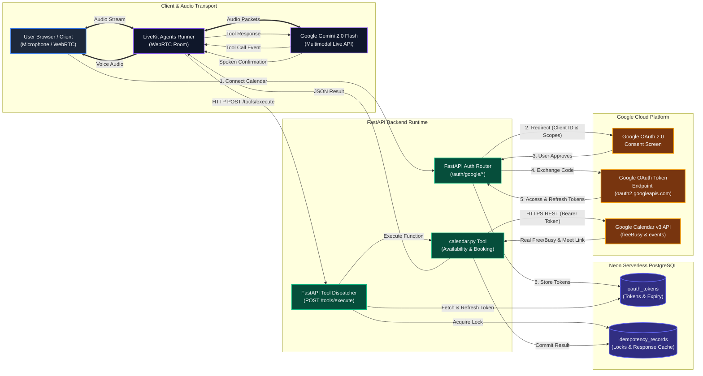

# AI Voice Assistant: Live End-to-End System Flow Architecture

> **Document Version:** 2.0.0  
> **Status:** Production Architecture (Verified Live)  
> **Components:** WebRTC Voice Client, LiveKit Agent, Gemini 2.0 Flash Live, FastAPI Dispatcher, Neon PostgreSQL, and Google Calendar v3 API.

---

## 1. High-Level Architectural Diagram



---

## 2. Phase 1: One-Time Google OAuth 2.0 Setup Flow

This flow connects the user's Google Account and stores persistent credentials in **Neon PostgreSQL**:

```
[User Browser]
      │
      │ 1. Clicks "Connect Google Calendar"
      ▼
[FastAPI: /auth/google/login]
      │
      │ 2. Generates state (with user_id) & redirects with Client ID
      ▼
[Google OAuth 2.0 Consent Screen]
      │
      │ 3. User logs in (elihu.metabox@gmail.com) & grants Calendar permissions
      ▼
[FastAPI: /auth/google/callback?code=4/0A...]
      │
      │ 4. POST code + client_secret to https://oauth2.googleapis.com/token
      ▼
[Google OAuth Token Endpoint]
      │
      │ 5. Returns access_token (1 hr) + permanent refresh_token
      ▼
[FastAPI: /auth/google/callback]
      │
      │ 6. UPSERT into Neon PostgreSQL: oauth_tokens
      ▼
[Neon PostgreSQL: oauth_tokens] ──► { user_id, provider: 'google', access_token, refresh_token, expires_at }
      │
      ▼ 7. Renders dark-mode "Google Calendar Connected" Success Screen in Browser
```

---

## 3. Phase 2: Real-Time Voice Conversation & Tool Execution Flow

This flow executes when the user speaks a calendar request during a live voice call:

```
                                  VOICE CONVERSATION TIMELINE
                                  
  User speaks: "Schedule a 30-minute sync with Sarah tomorrow at 2 PM"
      │
      │ (Audio packets via WebRTC)
      ▼
  [LiveKit Agent + Google Gemini 2.0 Flash Live]
      │
      │ Gemini analyzes audio & outputs Tool Call:
      │ book_event(title="Sync with Sarah", start_time="2026-09-19T14:00:00Z", duration=30)
      │
      ▼
  [POST http://localhost:8000/tools/execute] (FastAPI Dispatcher)
      │
      ├──────────────────► STEP 1: Idempotency Lock
      │                    FastAPI checks Neon DB (idempotency_records).
      │                    Acquires an atomic lock to guarantee ZERO duplicate bookings on network drops.
      │
      ├──────────────────► STEP 2: Token Acquisition & Silent Auto-Refresh
      │                    FastAPI queries Neon DB (oauth_tokens) for user_id.
      │                    - If token expires in < 5 mins, silently exchanges refresh_token with Google.
      │                    - Injects live access_token: "Bearer ya29.a0AdMD6EgU..."
      │
      ├──────────────────► STEP 3: Live Google Calendar API Call
      │                    FastAPI calls Google Calendar API v3 asynchronously:
      │                    POST https://www.googleapis.com/calendar/v3/calendars/primary/events?conferenceDataVersion=1
      │                    - Creates calendar appointment on elihu.metabox@gmail.com
      │                    - Auto-provisions Google Meet video link
      │
      ├──────────────────► STEP 4: Commit Idempotency & Database State
      │                    FastAPI writes Google event payload (event_id, meet_link)
      │                    into Neon DB (idempotency_records) with status = 'committed'.
      │
      ▼
  [FastAPI returns JSON Response (<400ms)]
  {
      "status": "success",
      "data": {
          "event_id": "0v8q6...",
          "meet_link": "https://meet.google.com/xyz-abcd-uvw",
          "source": "google_calendar_live"
      }
  }
      │
      │ LiveKit sends tool output back into Gemini Live audio session
      ▼
  [Google Gemini 2.0 Flash Live]
      │
      │ Grounded Confirmation: Sees status="success" + valid Google Meet URL
      ▼
  User hears spoken voice: 
  "I've scheduled your 30-minute sync with Sarah for tomorrow at 2 PM. I've added a Google Meet link to your calendar invite!"
```

---

## 4. Key Architectural Corrections from the Old Diagram

| Item | Old Diagram (Initial Concept) | Actual Production Implementation (Verified Live) |
| :--- | :--- | :--- |
| **Token Table** | Labeled as `user_preferences` | Dedicated **`oauth_tokens`** table (UUID user_id, encrypted tokens, expiration timestamps, auto-refresh support). |
| **Event Storage** | Implied events saved in PostgreSQL | **Google Calendar is the single source of truth**. Events are created and fetched live on Google's cloud; Neon stores tokens and idempotency locks. |
| **Concurrency Safety**| Not pictured | **3-Phase Idempotency Engine** in `idempotency_records` (`acquired` -> `committed` / `refunded`) to prevent duplicate bookings. |
| **Voice Transport** | Not pictured | **LiveKit Agents + Gemini 2.0 Flash Live** streaming bidirectional audio over WebRTC. |
| **Conferencing** | Standard appointment | **Automated Google Meet Video Conferencing** requested via `conferenceDataVersion=1` and returned directly to the caller. |
