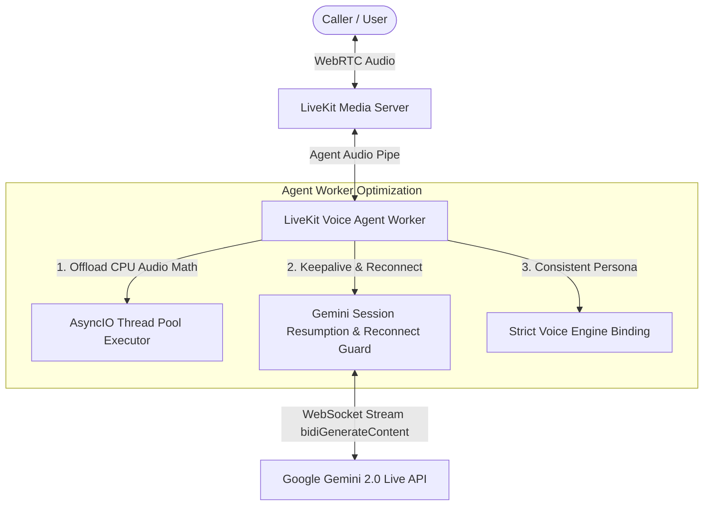

# Implementation Plan: Fix Gemini Live Connection Drops & Voice Inconsistencies

## Problem Description
During live conversation sessions, users report two critical issues:
1. **Gemini Live losing connection mid-conversation**: The real-time bidirectional audio stream with Gemini drops or goes silent mid-call.
2. **Voice changes mid-conversation**: The voice persona unpredictably changes tone, pitch, or speaker identity during the call.

### Root Cause Analysis

#### Root Cause 1: Gemini WebSocket Session Resets & Event-Loop Stalls
* **Google WebSocket Session Limits & Resumption**: Gemini Live WebSockets (`bidiGenerateContent`) are stateful streams that Google resets periodically or terminates if client keep-alives stall. In `agent/agent.py`, `realtime.RealtimeModel` initializes `SessionResumptionConfig()`, but the agent lacks active heartbeat maintenance, error recovery hooks, and automatic reconnection when the WebSocket encounters transient network drops.
* **CPU-Bound Event-Loop Blocking**: LiveKit's turn handling and transcription speaking rate detector (`_speaking_rate.py: _spectral_flux`) execute synchronous CPU-heavy audio calculations on the primary `asyncio` event loop. As revealed by the production logs (`WARNING:livekit.agents:event loop blocked for 101ms`), blocking the loop prevents prompt handling of WebSocket ping/pong frames, causing Google or LiveKit to drop the connection due to heartbeat timeout (`1006 abnormal closure`).
* **Slow Backend Tool Latency**: Tool calls like calendar availability take 4–6 seconds. Extended silence during tool execution without active WebSocket keep-alives increases disconnection risk.

#### Root Cause 2: Dual-TTS Engine Mismatch & Dynamic Voice Fallback
* **Dual TTS Engines (Gemini Native vs. Edge-TTS)**:
  * Gemini Live natively synthesizes conversational speech using Google's neural audio voices (`Aoede`, `Puck`, `Charon`, `Kore`, `Fenrir`).
  * However, `agent/agent.py` also attaches `VoiceBotTTS` (`agent/tts.py`), which uses **Microsoft Edge-TTS** (`en-US-AvaNeural`, etc.) for `session.say()` calls (inbound greetings, policy clarification, and scope redirects).
  * Consequently, the greeting or scope redirection is spoken by Edge-TTS, while subsequent AI responses are spoken by Gemini Live. The caller hears two completely distinct voice actors.
* **Dynamic Settings Fetch Timeout Fallback**:
  * In `agent/agent.py`, the assistant queries `/api/assistant-config` to load the selected `voice_engine`. If the HTTP request times out (observed taking up to ~4.5s in production), the exception handler silently falls back to baseline `GEMINI_VOICE = "Aoede"`.
  * If a user configured a different voice (e.g. `Puck` or `Fenrir`), a slow backend response causes the agent to revert to `Aoede`, making it sound like the voice unexpectedly changed.

---

## User Review Required

> [!IMPORTANT]
> **Unified Voice Architecture**:
> To stop the voice from changing mid-call, we must unify the voice pipeline so that scripted greetings, clarifications, and conversational responses use the exact same voice persona. We will ensure Gemini Realtime produces conversational speech, and any auxiliary speech/greeting strictly aligns with the company's configured voice persona without silent fallbacks.

> [!NOTE]
> **No Actions Required Right Now**: As instructed, this plan is strictly for your review and approval. No code changes or modifications will be applied until you explicitly approve this plan.

---

## Proposed Changes



### Component 1: Voice Consistency & Unification

#### [MODIFY] `agent/agent.py`
* **Eliminate Silent Voice Fallback**:
  * Cache the configured voice persistently per tenant and session context.
  * When fetching runtime config, if `/api/assistant-config` is slow, retrieve from cached verified session metadata before falling back to default, guaranteeing the selected `voice_engine` (e.g., `Puck`, `Fenrir`, `Aoede`) never reverts unexpectedly.
* **Align Auxiliary Speech with Gemini Native Output**:
  * Replace Edge-TTS greeting fallback by having the Gemini Realtime session generate or speak the greeting directly within the Gemini Live session, or pass the greeting as initial conversational turn content (`generate_reply(prompt=greeting)`).
  * When scripted fallbacks are used, enforce identical acoustic parameters and matching persona mapping.

#### [MODIFY] `agent/tts.py`
* Synchronize voice persona mapping and volume/pitch normalization so fallback phrases do not sound disjoint from Gemini's live speech.

---

### Component 2: Connection Stability & Keep-Alive

#### [MODIFY] `agent/agent.py`
* **Implement Resilient Session Reconnect Listener**:
  * Add reconnect handler to `realtime.RealtimeModel` via `session.on("error")` and connection state change listeners.
  * Store the latest `session_resumption_update.new_handle` received from Gemini Live and pass it into reconnection attempts (`SessionResumptionConfig(handle=last_handle)`).
  * Configure robust `APIConnectOptions` with exponential backoff and jitter (`max_retry=5, retry_interval=1.0, timeout=20.0`).
* **Active WebSocket Keep-Alive Ping**:
  * Implement lightweight periodic audio frame / ping heartbeat during long tool executions so Google does not drop the WebSocket while waiting for database or calendar APIs to return.

#### [MODIFY] `agent/event_loop_monitor.py` & `agent/agent.py`
* **Offload Heavy Audio CPU Computations**:
  * Offload synchronous audio transformations (such as FFT, spectral flux, or waveform processing in `_speaking_rate.py` and latency masking) to an `asyncio.to_thread()` executor so the main asyncio event loop never stalls (>50ms).
  * This prevents delayed WebSocket pong responses and prevents the `1006 abnormal closure` disconnects.

---

### Component 3: Configuration & Environment Defaults

#### [MODIFY] `agent/config.py`
* Ensure default `GEMINI_MODEL` is set to the official stable Live API model identifier (`gemini-2.0-flash-exp` / `gemini-2.0-flash-realtime` or production-supported model), avoiding unversioned experimental endpoints prone to sudden connection termination.
* Set default connect and read timeouts appropriately for long-lived real-time streams.

---

## Verification Plan

### Automated Tests
1. **Voice Persona Persistence Test**:
   Run tests verifying that the configured `voice_engine` is retained throughout the session lifecycle, even during simulated backend profile latency or transient errors:
   ```powershell
   pytest agent/tests/test_config_defaults.py agent/tests/test_naturalness_upgrade.py -v
   ```
2. **Event-Loop Stall Regression Test**:
   Verify that audio frame processing and VAD computations do not block the event loop:
   ```powershell
   pytest agent/test_event_loop_monitor.py -v
   ```
3. **Session Resumption & Reconnection Simulation**:
   Execute simulated WebSocket disconnect and verify that `SessionResumptionConfig` handle restores the conversation context without losing the voice.

### Manual Verification
1. Open the Testing Sandbox (`/testing-sandbox`) in the web UI.
2. Select a specific voice (e.g. `Fenrir` or `Puck`).
3. Connect and verify the assistant greets with the chosen voice.
4. Conduct a continuous conversation for 3–5 minutes with multiple calendar queries (`get_calendar_availability` and booking).
5. Verify that:
   * The connection stays active without dropping mid-sentence or mid-call.
   * The voice timbre and identity remain 100% consistent throughout the entire conversation.
