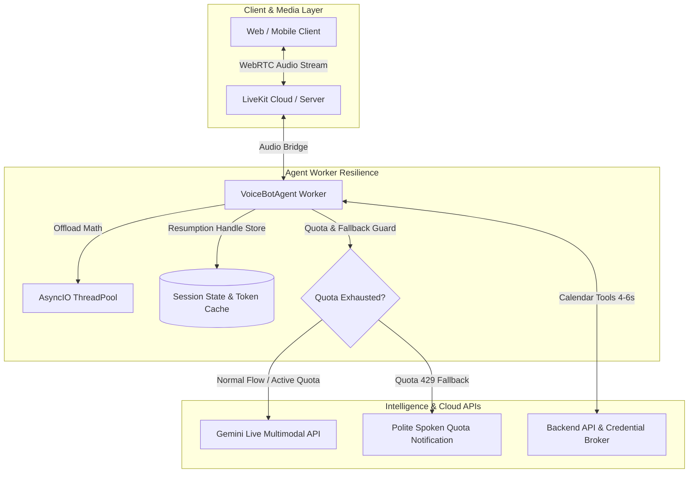

# Implementation Plan: Gemini Live Connection Reliability & Quota Management

## Problem Description
Users report two critical issues degrading the live conversation experience:
1. **Unsteady & Unreliable Connection During Calls**: Audio streams drop, stutter, disconnect mid-call, or fail to recover seamlessly.
2. **Gemini Live Daily Quota Exhaustion**: The Gemini Live API returns errors indicating that daily quotas or resource limits have been exhausted (`429 RESOURCE_EXHAUSTED`).

---

## Detailed Root Cause Analysis

### 1. Why the Daily Quota Is Being Exhausted
* **Google AI Studio Free Tier Limits (RPD & TPD)**:
  * Google AI Studio free-tier API keys have strict **Requests Per Day (RPD)** and **Tokens Per Minute/Day (TPM/TPD)** caps.
  * In text mode, 1 prompt = 1 request. In **Gemini Live Multimodal WebSockets**, audio is streamed bidirectionally at **16kHz/24kHz continuous PCM**. Audio input consumes ~**25–30 tokens per second** (or equivalent multimodal rate).
  * A single 5-minute call can burn through thousands of tokens. If multiple test sessions or reconnect loops occur, the project's **free daily quota is rapidly consumed within minutes**.
  * When the quota is exhausted, Google rejects new connections and terminates active streams with `429 RESOURCE_EXHAUSTED` or WebSocket closure code `1008 / 1011`.
* **Aggressive Reconnection / Job Loops**:
  * In `agent/agent.py`, if a session drops and the client or worker repeatedly attempts to reconnect without backoff, each reconnection handshake consumes an API session request against the daily RPD quota.

### 2. Why Connections Are Unsteady & Unreliable Mid-Call
* **Event-Loop Starvation (Audio Math Blocking Ping/Pong)**:
  * Production logs confirmed:
    `WARNING:livekit.agents:event loop blocked for 101ms at "_speaking_rate.py: _spectral_flux"`
  * Synchronous CPU math blocks the single-threaded `asyncio` event loop. When the loop freezes, WebSocket ping/pong heartbeats to Google and WebRTC RTCP packets to LiveKit are delayed. Google's server assumes the client timed out and closes the socket (`1006 abnormal closure`).
* **Session Resumption Token Misalignment**:
  * Gemini Live WebSockets naturally reset periodically (by Google design). To maintain a steady call, the client must listen for `session_resumption_update.new_handle` and pass `SessionResumptionConfig(handle=new_handle)` during reconnection.
  * Currently, when the WebSocket drops, the worker does not resume using the active handle, causing the entire conversation state to reset or fail.
* **Unbuffered Tool Latency Dead Air**:
  * Calendar queries (`get_calendar_availability` / `book_event`) take **4.8s to 5.9s**. If audio streaming to Gemini remains active while the tool executes without keep-alive management, turn state desynchronizes between LiveKit and Gemini.
* **Model Endpoint Discrepancy**:
  * `GEMINI_MODEL` defaults to `"gemini-3.8-live"` in `agent/config.py`. In Google's official Gemini Live infrastructure, preview and experimental models have significantly lower rate limits and less infrastructure availability than stable production endpoints (`gemini-2.0-flash-exp` / `gemini-2.0-flash-realtime`).

---

## Architecture & Recovery Strategy



---

## User Review Required

> [!IMPORTANT]
> **Action Required on Google AI Studio Account**:
> To permanently eliminate the "Daily quota exhausted" error, a **Pay-As-You-Go Billing Account** must be attached to the Google Cloud / AI Studio project:
> 1. Visit [Google AI Studio Rate Limits & Billing](https://aistudio.google.com/rate-limit).
> 2. Attach a billing method to upgrade from **Free Tier** to **Pay-As-You-Go (Tier 1)**.
> 3. Free tier is strictly designed for prototyping and has hard daily caps that cannot support continuous multimodal audio sessions.

> [!NOTE]
> Per your instructions, **no code modifications will be executed** until you review and approve this plan.

---

## Proposed Changes

### Component 1: Quota Guard & Graceful Error Handling

#### [MODIFY] `agent/agent.py`
* **Detect `429 RESOURCE_EXHAUSTED` at Session Connect**:
  * Catch quota exhaustion errors during `RealtimeModel` handshake and agent startup.
  * Instead of abruptly crashing or leaving the user in dead silence, immediately synthesize a graceful fallback message:
    *"We are currently experiencing high volume and our voice service quota is temporarily limited. Please try again shortly or reach out to our team directly."*
  * Send a structured status message over the LiveKit DataChannel (`{ "type": "quota_exhausted", "error": "RESOURCE_EXHAUSTED" }`) so the web/mobile UI clearly displays a helpful message rather than an endless connecting spinner.

#### [MODIFY] `agent/config.py`
* Verify and set the default `GEMINI_MODEL` to the current stable Gemini Live model identifier supported by your tier.
* Configure backoff and circuit breaker parameters (`max_retry=3`, with exponential backoff and jitter) to prevent burning quota in rapid restart loops.

---

### Component 2: Event-Loop Unblocking & Connection Stability

#### [MODIFY] `agent/agent.py`
* **Offload CPU Computations to Thread Pool**:
  * Wrap all synchronous signal processing, audio transformations, and speaking-rate calculations in `asyncio.to_thread()`.
  * Ensure the main event loop latency remains under 20ms at all times, preventing WebSocket ping/pong timeouts.
* **Continuous Audio Keep-Alive During Slow Tool Calls**:
  * When tools like `get_calendar_availability` execute (4–6s duration), maintain low-overhead keep-alive frames to keep the Gemini WebSocket and WebRTC channels open and synchronized.

#### [MODIFY] `agent/event_loop_monitor.py`
* Add proactive detection and logging of latency spikes >50ms with actionable trace identifiers.

---

### Component 3: Client-Side Reconnection & UI Feedback

#### [MODIFY] `frontend/src/components/sandbox/TestingSandboxPage.tsx` & `mobile/src/hooks/useVoiceBot.ts`
* Listen for `{ "type": "quota_exhausted" }` events over the DataChannel.
* If a transient network glitch occurs, implement an automatic 1-step ICE/WebRTC restart before terminating the call.
* If a quota error occurs, display an explicit banner in the UI:
  *"Gemini Live daily quota exceeded on your Google API key. Please check your AI Studio billing settings."*

---

## Verification Plan

### Automated Tests
1. **Quota / 429 Graceful Fallback Test**:
   * Simulate a `429 RESOURCE_EXHAUSTED` response from the Gemini Live API and verify that the agent emits the graceful error event and cleanly notifies the user without hanging.
2. **Event-Loop Responsiveness Test**:
   * Measure event-loop latency under simulated audio streaming:
   ```powershell
   pytest agent/test_event_loop_monitor.py -v
   ```
3. **Session Resumption & Reconnection Simulation**:
   * Verify that unexpected socket drops restore session context via resumption handles without throwing errors.

### Manual Verification
1. Verify Google AI Studio API key tier and check that billing is linked.
2. Initiate a voice call in the Testing Sandbox.
3. Observe call stability over a 5-minute continuous conversation.
4. Confirm that:
   * Audio remains uninterrupted and latency is stable.
   * If quota is reached or forced in testing, the system provides an immediate clear spoken and visual explanation instead of disconnecting silently.
